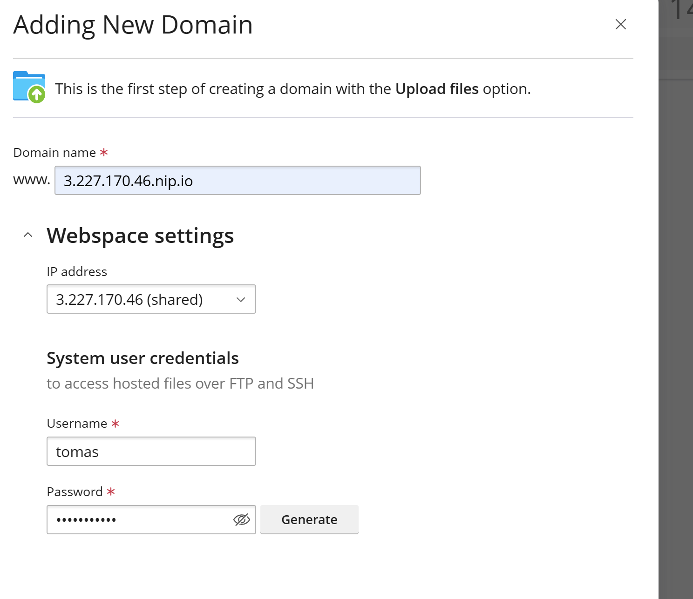

# Plesk

## Instalación y Configuración de Plesk

Este documento proporcionara una guía paso a paso para instalar plesk y instalar un sitio web estatico y wordpress.

### Instalar Plesk
Tendremos nuestra instancia de plesk y dentro de ella le asignaremos unos grupos de seguridad

Tambien al acceder a nuestra instancia le instalaremos plesk para posteriormente instalar nuestra web y wordpress

Una vez instalado vamos a acceder a nuestra pagina web de plesk
g

Configuramos todo para acederg

ggggg
Ahora vamos a instalar 2 webs diferentes:

### Instalar Web Estatica

### Instalar Wordpress

Con esto dariamos por terminada la practica
